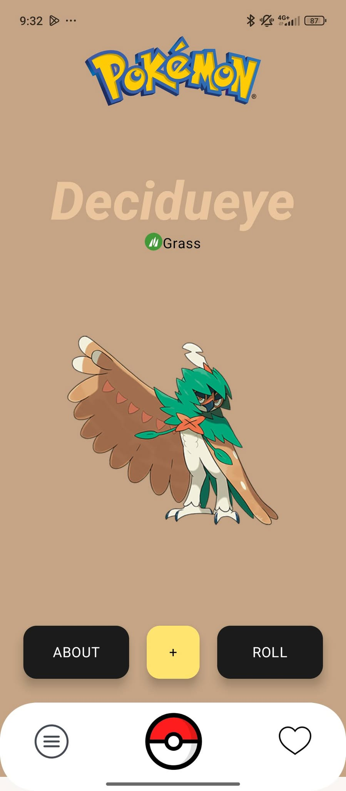
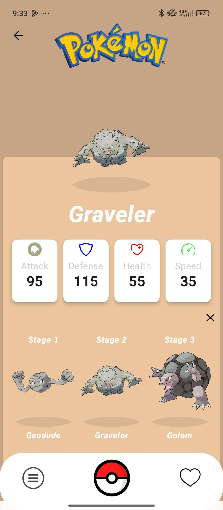
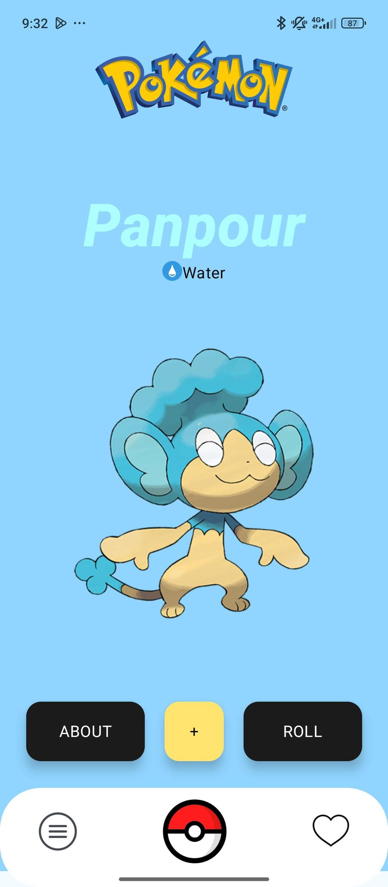

📚 Jetpack Compose Pokémon Library
An elegant, Android-native Pokémon Library App built with Jetpack Compose, featuring a random Pokémon generator and a searchable Pokédex with detailed Pokémon info — all backed by local storage for smooth offline access.

🧩 About the App
This mobile app brings the world of Pokémon to your fingertips:

🎲 Randomizer: Discover a new Pokémon every time you tap.

📋 All Pokémon Screen: Browse or search the full Pokédex.

📖 Details View: View stats, types, and evolutions.

💾 Offline Support: Pokémon data is stored locally using RoomDB, so you can browse even without an internet connection.

🛠️ Tech Stack
Jetpack Compose – Declarative UI framework for modern Android apps.

Jetpack Navigation – For clean and manageable screen navigation.

Retrofit – To fetch Pokémon data from the PokeAPI.

RoomDB – Local database to cache Pokémon data for fast and offline access.

Coil – Image loading library to fetch and display Pokémon sprites.

Material 3 – Sleek and responsive design system.

📱 Screenshots & Features
🏠 Main Screen – Randomizer

    

Tap to reveal a random Pokémon.

Displays name, image, and stats in a stylish layout.

📄 Pokémon Details Screen

   

Shows type, base stats, abilities, and evolutions.

Clean layout for fast lookups and comparisons.

📋 All Pokémon (Pokédex) Screen

  

Browse the entire Pokédex.

Search by name with offline support.

🚀 Future Improvements
Filter by type (e.g., Grass, Electric, Ghost).

Add a "Favorites" feature with persistent storage.

Evolution chain viewer.

Shiny variant toggle.

Dark/light mode toggle 🌗.

Paginated or infinite scroll for better performance with large datasets.
